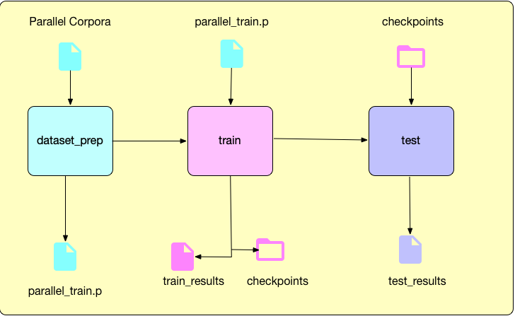

# About
English - Hindi Neural Machine Translation model experiments using new tensorflow 2.0 (alpha) keras apis.

# Orginization:
## models  

* utils.py - shared utility functions  

* score.py - utility module to compute BLEU-4 score on the translation results  

* data_prep.py - utility functions to help data preprocessing  

## models/model_n folders  

* model artifacts such as encode, decoder  

* train: notebook to train the model  

* test: notbook to test the model  

# Process

# Model Changes
| Model | Data Prep Changes| Model Changes|
| :---: | :---: | :---: | 
| Model 1 | lower case'ed, removed special chars, shuffled corpus | standard gru based encode-decoder-attention | 
| Model 2 | <pad> at position 0 in the word2idx; skipped single word sentences with <uwn> | Used 50 dim Glove enbedding for source, masking 0s | 
| Model 3 | removed segments with more non-alpha chars than alpha chars | 100 dims glove embedding; Stached encoder-decoder with 2 layers | 
| Model 4 | normalized nukta chars | reversed source input during training | 

# References
* Anoop Kunchukuttan, Pratik Mehta, Pushpak Bhattacharyya. The IIT Bombay English-Hindi Parallel Corpus. Language Resources and Evaluation Conference. 2018.
* Tensorflow Tutorials: https://www.tensorflow.org/tutorials . Some code borrowed for fast prototyping.
* GLOVE embedding for English: https://nlp.stanford.edu/projects/glove/
* Indic NLP library: https://github.com/anoopkunchukuttan/indic_nlp_library
